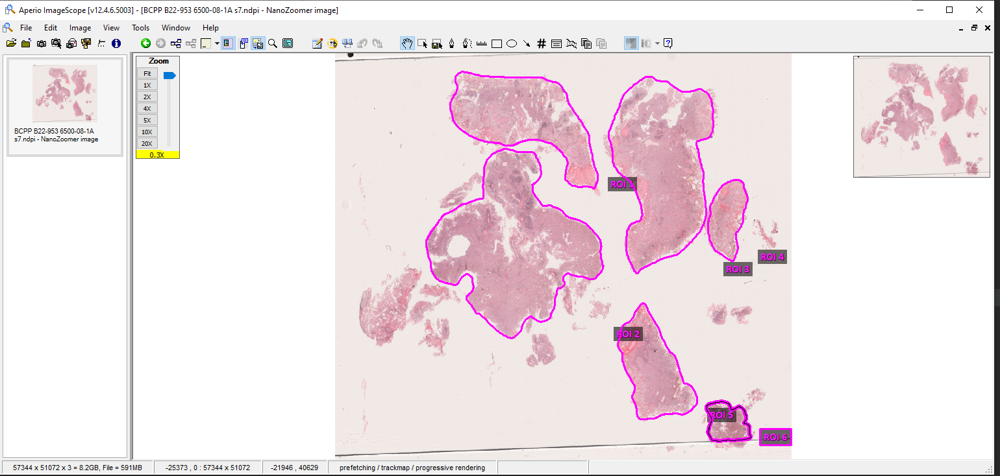
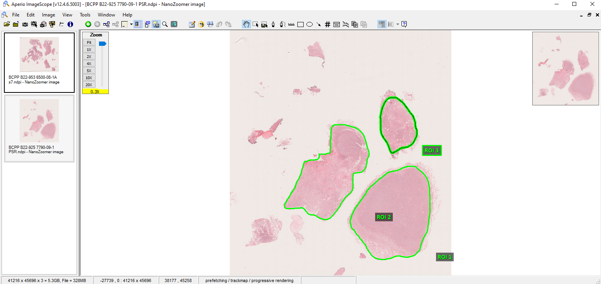

[](https://www.gnu.org/licenses/gpl-3.0)
[](https://doi.org/10.5281/zenodo.14231926)


# c-pmat : PSR STAIN PREPROCESSING WORKFLOW 

c-pmat ***C***omputational ***P***reprocessing of extracellular ***mat***rix 

c-pmat is an interactive user interface, allowing user to easily preprocess, quality control (QC) 
and generate quantitative extracellular matrix features.

Preprocess constitutes generating tiles and the corresponding metadata from the whole slide images.
Quality control is dependant on annotations and this retains the tiles free of artifact and 
tiles belonging to the annotated regions and ensures enough tissue on the tile is present to 
perform downstream analysis.

Through the usage of the step by step process, user will be able to preprocess,
extract and quantify extracellular matrix features.

## Installation from pypi https://pypi.org/project/c-pmat/
```
pip install c-pmat==1.0.0

```

## Usage on command terminal for Mac Users
```
conda create -n pmat_test python=3.9 # Create a environment named pmat_test
conda activate pmat_test
#### Unzip the code from github to the Downloads directory ####
cd Downloads
cd c-pmat-main/src
pip install -r requirements.txt
cd c-pmat
python main.py

#### This opens the napari workflow orchestration window ####

Before attempting to run, please download the openslide binaries for mac
from https://openslide.org/download/
## Make a new directory Tools within the c-pmat-main directory, to keep all the ####
## c-pmat related tools intact ##
mkdir Tools

### Assuming you have Regions of interest annotations performed in Imagescope ###
The steps below are needed. If you do not have any region annotations, you can skip them.
### Lets say your name is Sam Joe and your mac user profile name is sam, then you will use sam where it says macuserprofile in the below path ###

Use a texteditor like sublimetext and drag and drop extract_ROIs_from_annotations.py into the editor and change the line 4
OPENSLIDE_PATH = r'C:\Tools\openslide-win64-20231011\bin' to

OPENSLIDE_PATH = r'/Users/macuserprofile/Downloads/c-pmat-main/Tools/openslide-bin-4.0.0.6-macos-arm64-x86_64/lib'

and save the script


```


## Understanding data preparation

In this section we will summarize the organization of directory structure to enable 
the end user extract the information needed to directly interact with the annotations which comes as a string
or different names provided by the pathologists (generic).

In the below example we have a first whole slide image with 6 regions of interest and they are named as 
ROI1, ROI2, .... ROI6 respectively and the second whole slide image with 3 regions of interest
ROI1, ROI2, ROI3 respectively. These annotations are free hand polygon annotations drawn on the tissue by the 
pathologists to infer the changes in the extracellular matrix components with respect to the individual ROI and 
cater for inter-tumour and intra-tumour heterogeneity and its implication of features at slide and ROI levels.

<p align="center">
  
  
</p>


Currently, we have the support for the annotations performed by the pathologists using Imagescope on the
PSR stained whole slide images.

Once you have annotations, it will retain the ROIs with respect to the individual slide automatically and extract the tiles
corresponding to each ROI.

Note: This code can be generically used for other brightfield images and extraction of the annotations performed on Imagescope.

## ROI stitching at low resolution

It also helps to restitch the ROI's at a lower resolution for sanity check so it can be further processed by TWOMBLI


## Extraction of features within c-PMAT framework
Note: PMAT name was unavailable on pypi hence c-PMAT

## Reference 
## Citation


1. https://doi.org/10.25418/crick.26565343
2. https://zenodo.org/records/14231926
   
