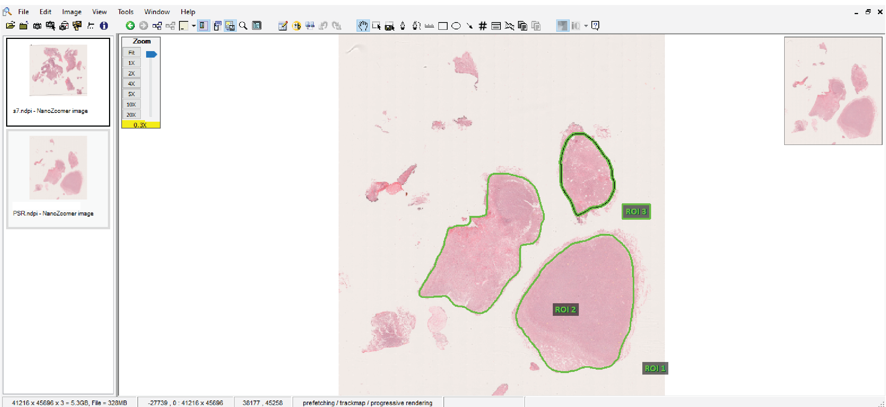

[](https://www.gnu.org/licenses/gpl-3.0)
[](https://doi.org/10.5281/zenodo.14231926)


# c-pmat : PSR STAIN PREPROCESSING WORKFLOW 

c-pmat ***C***omputational ***P***reprocessing of extracellular ***mat***rix 

c-pmat is an interactive user interface, allowing user to easily preprocess, quality control (QC) 
and generate quantitative extracellular matrix features.

Preprocess constitutes generating tiles and the corresponding metadata from the whole slide images.
Quality control is dependant on annotations and this retains the tiles free of artifact and 
tiles belonging to the annotated regions and ensures enough tissue on the tile is present to 
perform downstream analysis.

Through the usage of the step by step process, user will be able to preprocess,
extract and quantify extracellular matrix features.

## Installation from pypi https://pypi.org/project/c-pmat/
```
pip install c-pmat==1.0.2


```
## Usage on command terminal of Anaconda prompt in Windows ##
```
conda create -n pmat_test python=3.9 # Create a environment named pmat_test
conda activate pmat_test
#### Unzip the code from github to the Downloads directory ####
cd Downloads
cd c-pmat-main/src
pip install -r requirements.txt
cd c-pmat
python main.py
## Make a new directory Tools within the c-pmat-main directory, to keep all the ####
## c-pmat related tools intact ##
mkdir Tools
Download windows binaries from the site https://openslide.org/download/
Look for Binaraies and download the relevant version and in your script
you can add them so it can call the openslide relevanct functions
cd Downloads\c-pmat-main\Tools\openslide-win64-20231011\bin

## To Sucessfully test the openslide libraries are working in your environment ##
Open a anaconda command prompt
conda activate pmat_test
python
import os
OPENSLIDE_PATH=r'C:\Downloads\c-pmat-main\Tools\openslide-win64-20231011\bin
import platform

if platform.system() == 'Windows':
    # Windows

    if hasattr(os, 'add_dll_directory'):
        with os.add_dll_directory(OPENSLIDE_PATH):
            import openslide
   
elif platform.system() == 'Darwin':
    # macOS
    import openslide  # OpenSlide should be accessible if installed via Homebrew
else:
    # Other platforms (Linux)
    import openslide

print("OpenSlide imported successfully!")

This should run openslide in your pmat_test environment and not give any errors
if the library path is available.
```

## Usage on command terminal for Mac Users
```
conda create -n pmat_test python=3.9 # Create a environment named pmat_test
conda activate pmat_test
#### Unzip the code from github to the Downloads directory ####
cd Downloads
cd c-pmat-main/src
pip install -r requirements.txt
cd c-pmat
python main.py

#### This opens the napari workflow orchestration window ####

Before attempting to run, please install openslide for mac
from https://openslide.org/download/


```


## Understanding data preparation

In this section we will summarize the organization of directory structure to enable 
the end user extract the information needed to directly interact with the annotations which comes as a string
or different names provided by the pathologists (generic).

In the below example we have a first whole slide image with 6 regions of interest and they are named as 
ROI1, ROI2, .... ROI6 respectively and the second whole slide image with 3 regions of interest
ROI1, ROI2, ROI3 respectively. These annotations are free hand polygon annotations drawn on the tissue by the 
pathologists to infer the changes in the extracellular matrix components with respect to the individual ROI and 
cater for inter-tumour and intra-tumour heterogeneity and its implication of features at slide and ROI levels.

<p align="center">
  
  
</p>


Currently, we have the support for the annotations performed by the pathologists using Imagescope on the
PSR stained whole slide images. Annotations and the respective tiles extraction has a dependency on openslide package. But if you
do not have annotations, configuration of openslide can be excluded.

Once you have annotations, it will retain the ROIs with respect to the individual slide automatically and extract the tiles
corresponding to each ROI.

Note: This code can be generically used for other brightfield images and extraction of the annotations performed on Imagescope.

## Workflow Steps
1. Generate Tiles from each slides (computationally effective if num process is set to be greater than 1 when you have more than 3 slide to process)
   The option for num process is given in the combo box, where a user can select input field from the dropdown list, allowing users to either select a predefined option or enter a custom value based on number of processors
   available to process in the users laptop/desktop. This functionality automatically detects available CPU cores.
2. Generate ROI regions from the annotation (Use this tab/functionality only if you have annotated regions) # Annotations were used in the current project. If you dont have annotations, proceed to next tab after step 1.
3. Stitch processed outputs (Sanity check on the low resolution and high resolution images if needed. Generally recommended when you have more than 3 slide to process)
4. Feature descriptor extraction. The option for feature descriptor can be selected from the drop down list.

For all the tabs, the screenshot of each tab is attached for better planning of the workflow
### Tile Generation

1. Computationally optimized processing
2. Supports multi-core processing
3. User can select number of processors via a combo box and it automatically detects available CPU cores
4. Beneficial for processing multiple slides (>3 slides)
   
<p align="center">
  
</p>

### ROI Region Generation

1. Works with pathologist annotations from Imagescope
2. Optional step (can be skipped if no annotations exist)
3. Extracts regions of interest (ROIs) from annotated slides
<p align="center">
  

</p>

### Output Stitching

1. Sanity check on low and high-resolution images
2. Recommended for processing multiple slides
<p align="center">
  
</p>

### Feature Descriptor Extraction

1. Allows selection of feature descriptors from a dropdown
2. Enables quantitative analysis of extracellular matrix
<p align="center">
  
</p>

## ROI stitching at low resolution


It also helps to restitch the ROI's at a lower resolution for sanity check so it can be further processed by TWOMBLI

## Quickread for Users

Ensure proper OpenSlide installation
Use Anaconda environment for dependency management
Follow platform-specific installation instructions
Have annotations ready for detailed analysis

## Application advantages
Flexibility: Supports various use cases with or without annotations
Performance: Multi-processor support for efficient processing
User-Friendly: Interactive interface with step-by-step guidance

## Extraction of features within c-PMAT framework
Note: PMAT name was unavailable on pypi hence c-PMAT

## Reference 
## Citation


1. https://doi.org/10.25418/crick.26565343
2. https://zenodo.org/records/14231926
   
